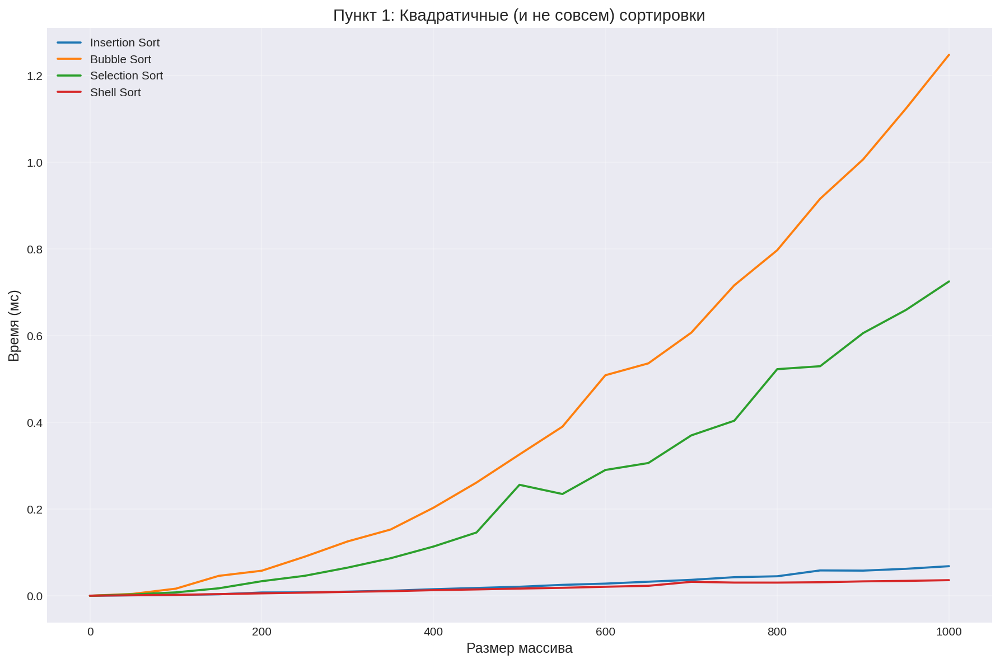
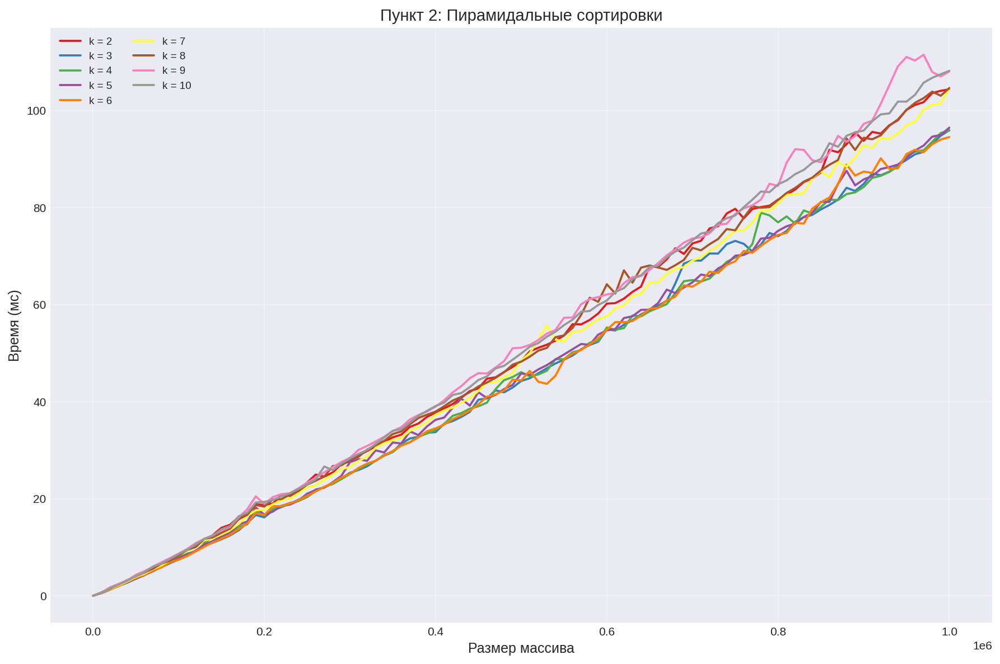
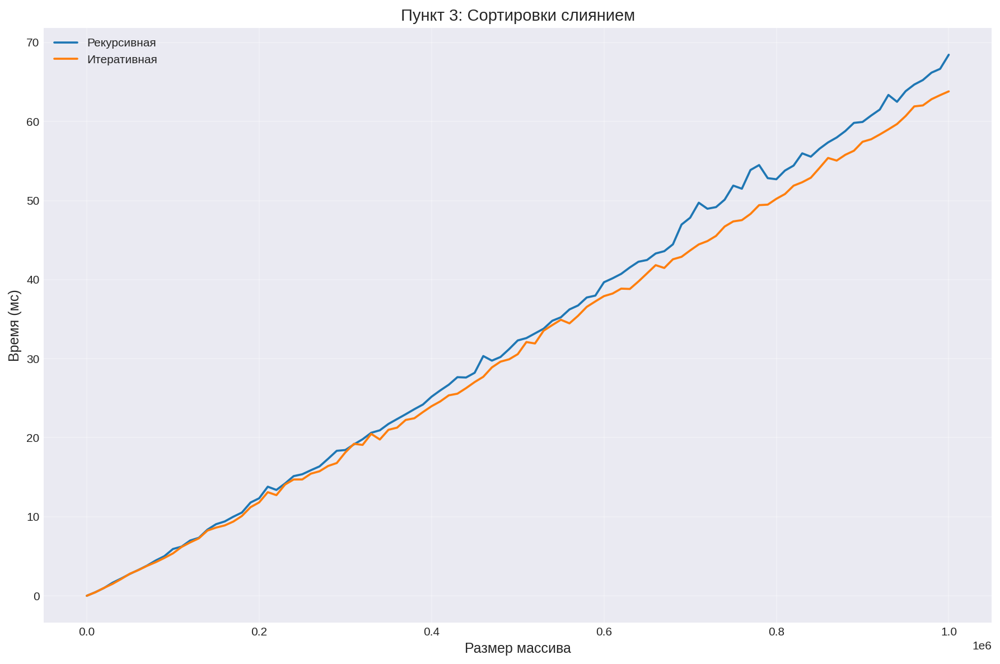
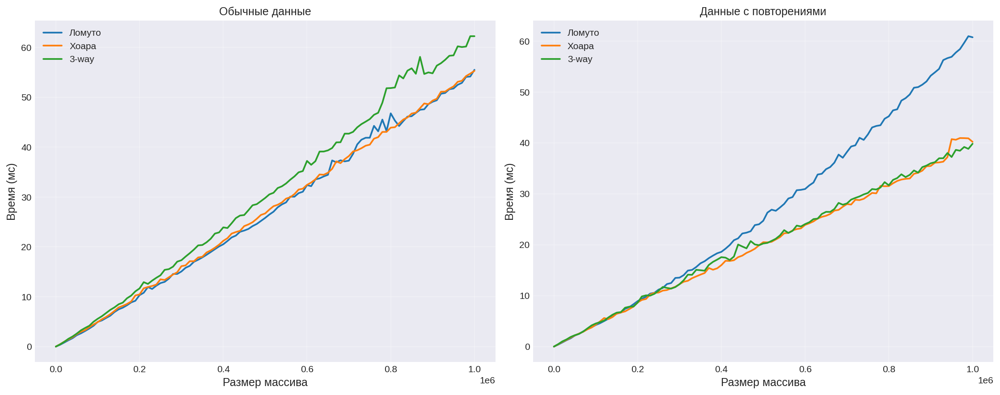
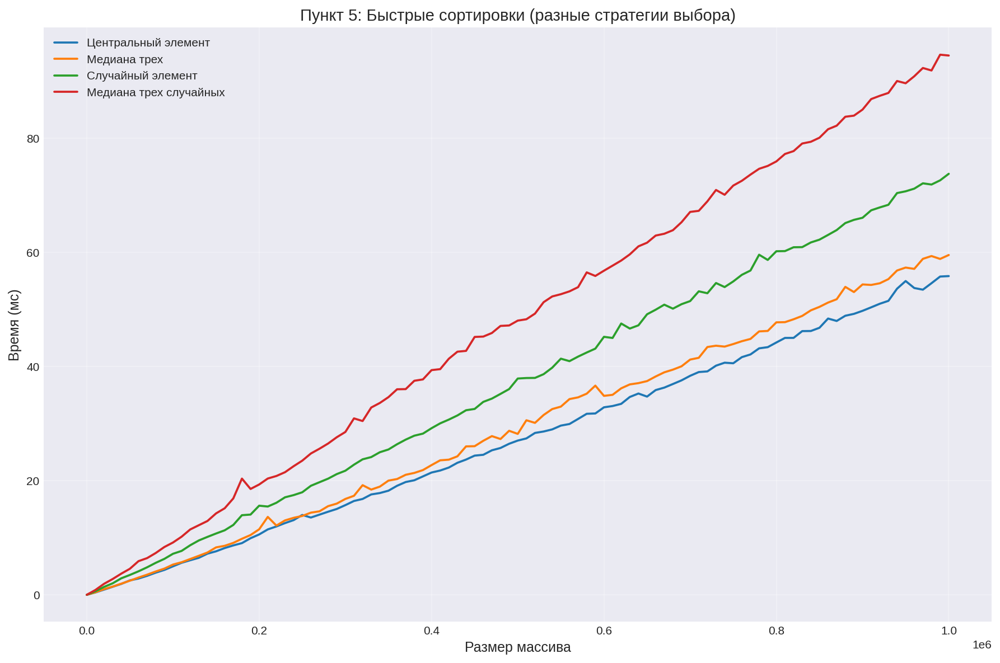
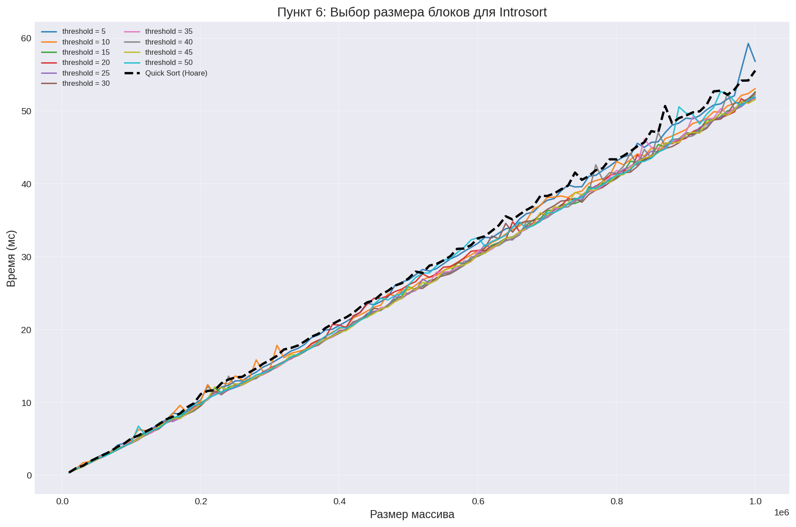
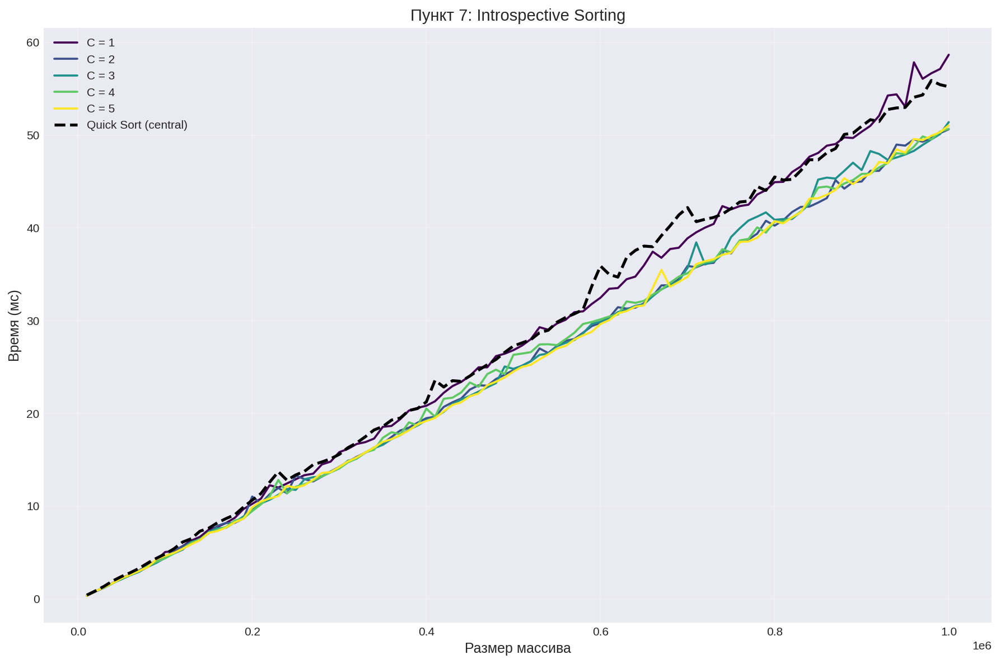
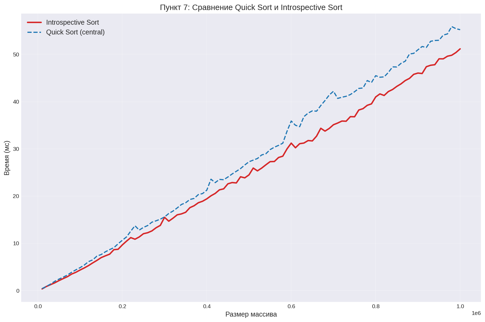
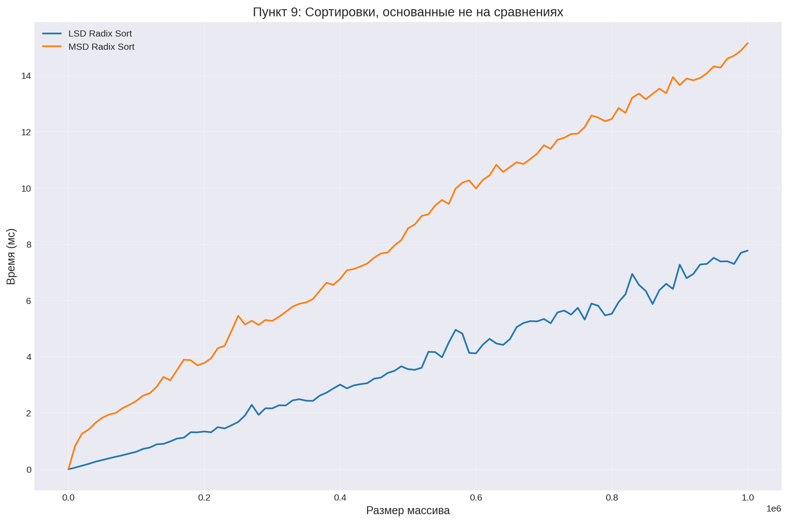
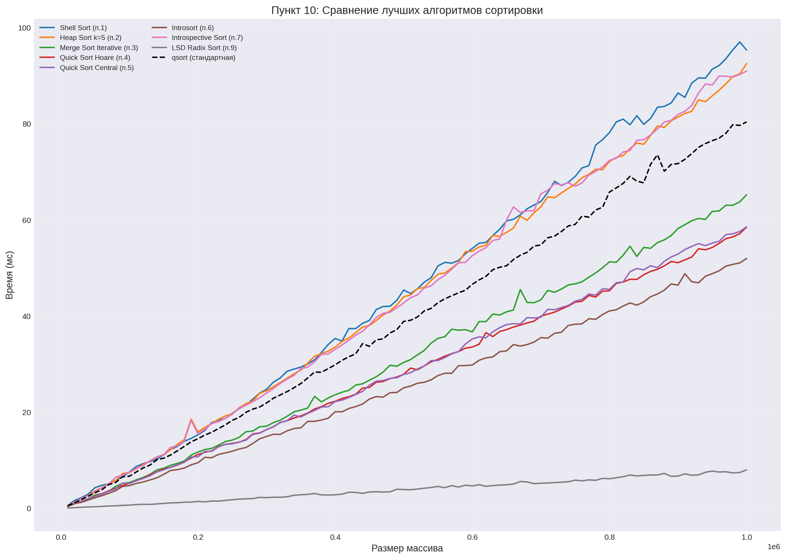

# Лабораторная работа: Сравнение алгоритмов сортировки

## Характеристики тестовой машины
- **CPU**: Intel Core i7-10750H

## Сборка и запуск

### Команды Makefile:

1. make - собрать все программы (generator, qsort_check, tester)
2. make clean - очистить собранные файлы и результаты
3. make clean_all - полная очистка (собранные файлы + результаты + тесты + venv)
4. make test - сгенерировать тесты и запустить тестирование
5. make run - запустить тестирование без генерации тестов
6. make plot - построить графики по результатам тестирования

### Для запуска только определенных пунктов нужно отредактировать в src/tester.c макросы:

// 1 - запустить, 0 - пропустить

#define RUN_POINT_1   1

#define RUN_POINT_2   1

#define RUN_POINT_3   1

// ...

## Пункт 1: Квадратичные сортировки

### Какая сортировка показала себя лучше всех?
Shell Sort показала лучшие результаты среди квадратичных сортировок. Это объясняется тем, что она использует сортировку вставками с убывающими шагами, что позволяет эффективно перемещать элементы, снижая общее количество сравнений и обменов.

## Пункт 2: Пирамидальные сортировки

### Какое k оказалось оптимальным?
Оптимальное k = 4. При k=2 (бинарная куча) количество сравнений максимально, так как высота кучи наибольшая. При увеличении k высота кучи уменьшается, но возрастает количество сравнений при просеивании (k сравнений на каждом уровне). Оптимальное время достигается при k = 4, где баланс между высотой кучи и количеством сравнений наилучший.

## Пункт 3: Сортировки слиянием

### Какой вариант работает лучше? Почему?
Итеративная версия работает лучше. Причины:
- Нет расходов на рекурсию - затрат на вызовы функций и т.п.
- Последовательная обработка данных
- Меньше операций с памятью

## Пункт 4: Быстрые сортировки (партиционирования)

### Что работает лучше?
Партиционирование Хоара показывает лучшие результаты, так как выполняет меньше обменов (хоть на первом графике Ломуто работает лучше, но если посмотреть на его работу на данных с повторениями, то становится очевидно, что это не самый оптимальный алгоритм, поэтому далее сортировки реализованы на партиционировании Хоара).

## Пункт 5: Стратегии выбора pivot

### Что работает лучше?
Лучше всего работает центральный элемент, медиана трех очень близко к нему, но немного уступает.

### Почему так?
Центральный элемент выигрывает потому что:
- Минимальные накладные расходы - просто берем arr[low + (high-low)/2], без дополнительных сравнений
- На случайных данных - центральный элемент статистически близок к медиане, разбиение получается сбалансированным
- Отсутствие худшего случая - в случайных данных вероятность получить наихудшее разбиение крайне мала

Медиана трех показывает близкий результат, но чуть хуже из-за:
- Дополнительных сравнений - нужно сравнить 3 элемента и переставить их
- Дополнительных обменов - для упорядочивания трех элементов

### Для каких стратегий можно придумать киллер-массивы?
- **Центральный элемент** - почти отсортированный массив или обратно отсортированный
- **Медиана трех** - "Ступенчатый" массив (1, 3, 5, 7, ..., 2, 4, 6, 8, ...) можно подобрать так, чтобы медиана трех всегда выбирала плохой pivot

### Какую стратегию все же выбрать?
**Центральный элемент**

Почему:
- Простота реализации - не требует дополнительного кода
- Минимальные накладные расходы - нет лишних сравнений и обменов
- Отличная производительность - на случайных данных работает лучше всех
- Медиана трех не дает значительного выигрыша - в тестах разница минимальна

Когда стоит выбрать медиану трех:
- Если есть риск наткнуться на почти отсортированный массив
- Если важна защита от худшего случая

**Итог:** Для общего случая со случайными данными оптимальный выбор - центральный элемент. Медиана трех может быть полезна, если мы знаем, что данные могут быть частично упорядочены.

## Пункт 6: Выбор размера блока для Introsort

Размер блока **40** оказался оптимальным, потому что:
- Shell Sort максимально эффективна на блоках такого размера
- Быстрая сортировка еще не успевает окупить свои расходы

## Пункт 7: Introspective Sorting

### График зависимости от C

### Сравнение с Quick Sort

### Стало ли работать лучше? Почему?
**Да**, Introspective Sort работает лучше, особенно на больших размерах.

Причины:
- Защита от худшего случая - при глубокой рекурсии алгоритм переключается на пирамидальную сортировку, которая гарантирует O(n log n) в любом случае
- Оптимизация малых блоков - Shell Sort эффективнее быстрой сортировки на массивах небольшого размера
- Оптимальный коэффициент C = 2 - позволяет быстрой сортировке работать на случайных данных, но переключается при первых признаках деградации

## Пункт 9: Поразрядные сортировки

### Какая сортировка работает лучше?
**LSD Radix Sort** работает лучше.

Причины:
- Линейный проход - LSD обрабатывает массив последовательно
- Без рекурсии - нет расходов на рекурсивные вызовы
- Время работы стабильно и не зависит от распределения данных

MSD Radix Sort требует рекурсивной обработки каждой группы, что увеличивает расходы и ухудшает производительность на случайных данных.

## Пункт 10: Сравнение лучших алгоритмов с qsort

### График всех лучших сортировок

В ходе лабораторной работы были реализованы и протестированы 12+ различных алгоритмов сортировки на массивах размером до 1,000,000 элементов.

### Почему некоторые (и какие) сортировки обогнали qsort?

**1. Merge Sort (итеративная)**
- Преимущество: отсутствие рекурсии, лучшее использование кэша
- Причина обгона: итеративный подход позволяет обрабатывать данные последовательно

**2. Introsort**
- Преимущество: защита от худшего случая через переключение на пирамидальную сортировку
- Причина обгона: не деградирует на частично упорядоченных данных, оптимальный порог 40 для переключения на Shell Sort

**3. Quick Sort (центральный элемент)**
- Преимущество: минимальные накладные расходы, простота реализации
- Причина обгона: на случайных данных центральный элемент дает сбалансированное разбиение

**4. LSD Radix Sort**
- Преимущества:
  - Линейная сложность O(n) против O(n log n) у qsort
  - Последовательный доступ к памяти
  - Предсказуемое время работы
- Причина обгона: для 32-битных целых чисел делает всего 4 прохода, что дает огромное преимущество

### Итог: победитель - **LSD Radix Sort**