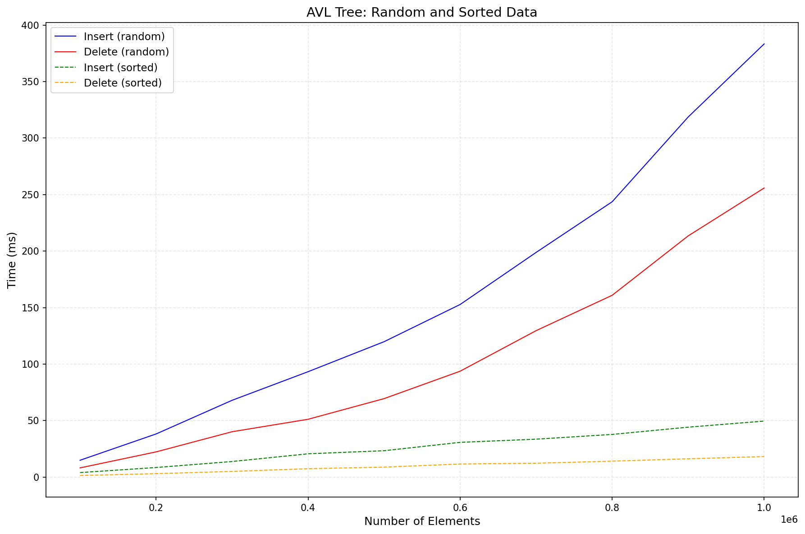
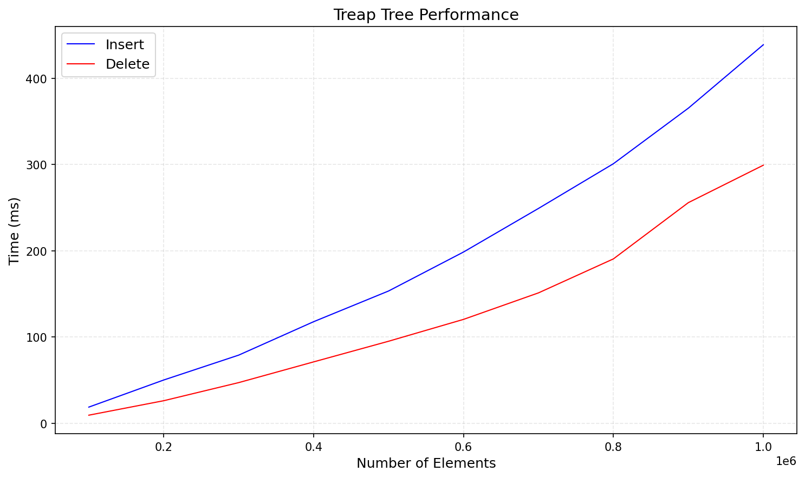
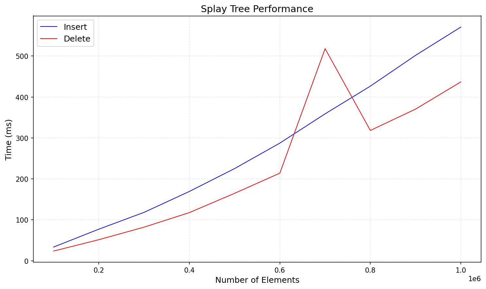
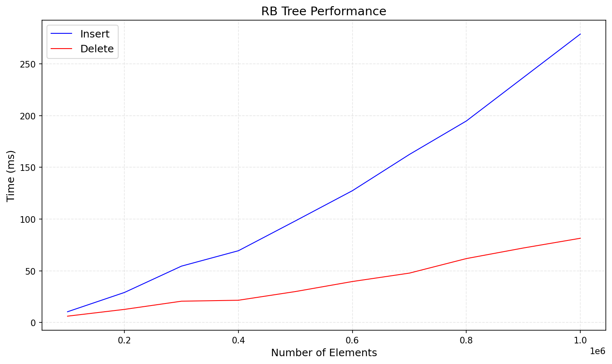
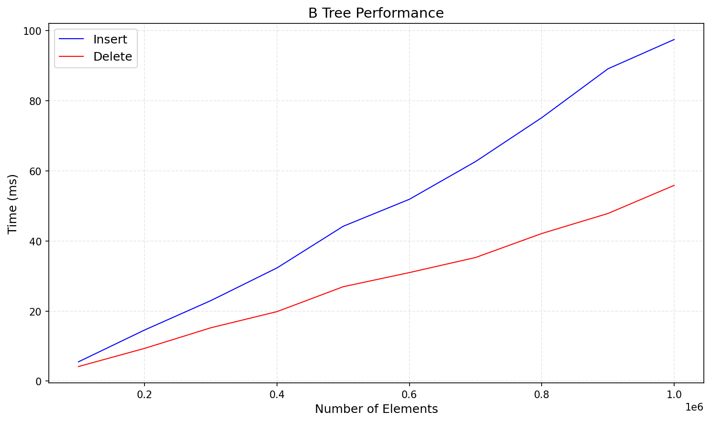
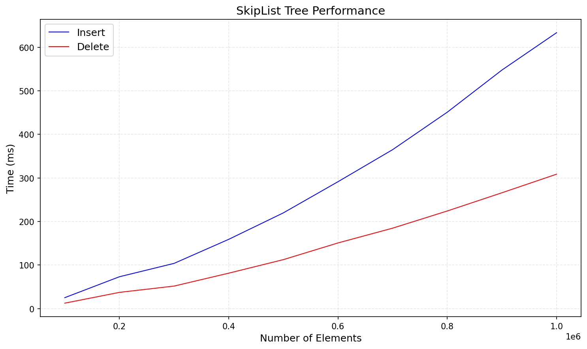
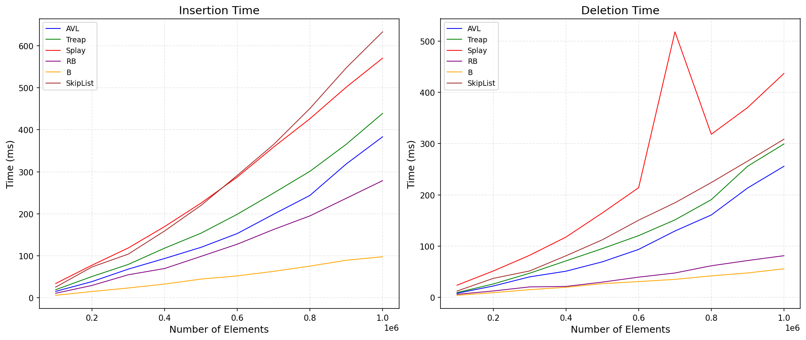

# Лабораторная работа: Деревья

## Сборка и запуск

1. **make all** - сборка
2. **make run** - запуск тестов
3. **make plot** - построение графиков
4. **make clean** - очистка

## Результаты тестирования

## Пункт 1: Наивное дерево поиска

 **Вывод:** Наивное дерево поиска показывает деградацию на отсортированных данных (120.99 ms против 16.04 ms на случайных). Это происходит потому, что дерево вырождается в линейный список, и операции вставки становятся O(n) вместо O(log n). 

### 2. AVL-дерево

**Вывод:** AVL на отсортированных данных работает значительно быстрее (49 ms против 398 ms), так как требует меньше поворотов при балансировке.

### 3. Декартово дерево

**Вывод:** Treap показывает стабильную производительность, близкую к AVL. Оно проще в реализации, чем AVL, но показывает чуть хуже результаты (особенно на больших размерах).

### 4. Splay дерево

**Вывод:** Splay показывает худшие результаты среди всех исследуемых деревьев (особенно на удалении). Это потому, что каждая операция поднимает узел в корень, требуя серии поворотов.

### 5. Красно-чёрное дерево

**Вывод:** Красно-чёрное дерево показывает хорошую производительность, (особенно на удалении). Оно менее строгое, чем AVL (допускает разницу высот до 2 раз), поэтому нужно меньше поворотов при вставке и удалении. 

### 6. B дерево

**Вывод:** B дерево показывает лучшую производительность среди всех деревьев. На 1000000 элементов высота B-дерева 3-4 уровня, а у бинарных деревьев 20+ уровней. Из-за этого мы видим большой выигрыш в скорости.

### 7. Skip List

**Вывод:**  Skip List показывает производительность на уровне Splay дерева. Оно сильно проигрывает B дереву и RB дереву. Это происходит из-за необходимости прохода по всем уровням при поиске, а также дополнительное выделение памяти.

### 8. Сравнение всех деревьев

**Вывод:** B дерево - лидер по скорости. Красно-чёрное и AVL тоже работают достаточно хорошо. Splay и Skip List работают медленнее всех.