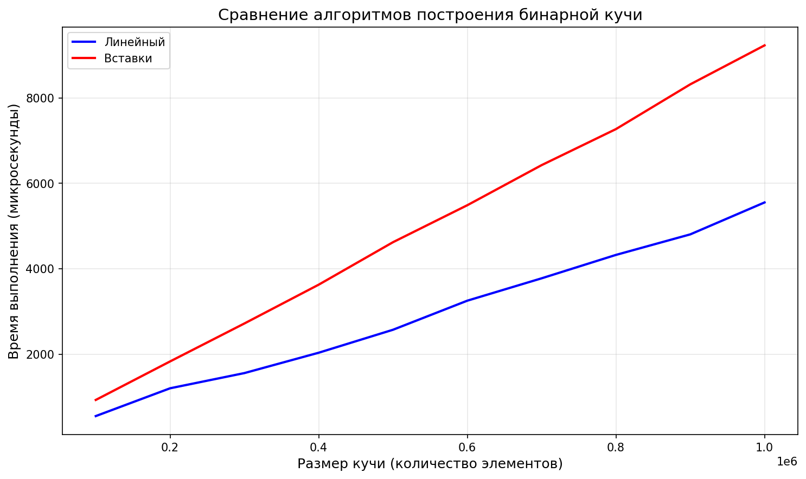
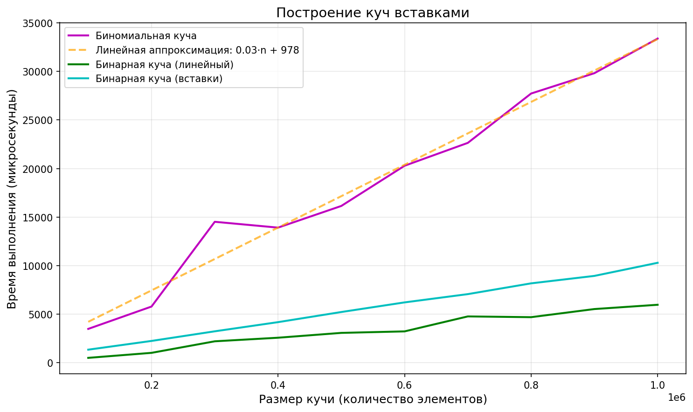

# Лабораторная работа №4: Кучи

## Сборка и запуск

#### Компиляция

make - собрать тесты

make clean - очистить собранные файлы

#### Запуск тестов

make run - запустить тесты и построить графики

## Результаты

### Бинарная куча

Было проведено сравнение двух алгоритмов построения бинарной кучи:

**Линейный алгоритм** - строит кучу за O(n)

**Обычные вставки** - строит кучу за O(n log n)

#### Вывод:

Линейный алгоритм показывает значительно лучшее время работы по сравнению со вставками.

Экспериментальные данные показывают, что линейный алгоритм работает в 1.5-2 раза быстрее алгоритма обычных вставок. Для худшего случая (отсортированные данные) выигрыш может быть более существенным.

### Биномиальная куча

Было проведено построение биномиальной кучи последовательными вставками для размеров от 100000 до 1000000 элементов.

#### Вывод:

График времени построения демонстрирует линейную зависимость от размера кучи.

Это объясняется тем, что амортизированная стоимость одной вставки в биномиальную кучу составляет O(1).

Теоретическая оценка времени работы: O(n) амортизированно.

Каждая вставка в биномиальную кучу работает за амортизированное O(1), 
следовательно, построение из n элементов - O(n).

**Метод монеток**

Аналогия с двоичным счетчиком:

При инкременте двоичного счетчика:
- Установка бита с 0 -> 1 стоит 1 операцию
- Очистка бита с 1 -> 0 стоит 1 операцию

Введём стоимость:
- 2 монетки за установку бита
- 0 монеток за очистку бита

1. При установке бита:
   - 1 монетка тратится на реальную операцию установки
   - 1 монетка откладывается на сам бит как резерв

2. При очистке бита:
   - Не тратим новых монеток
   - Используем ту самую резервную монетку, которая лежала на бите

Применение к биномиальной куче:

Соответствие:
- Установка бита = появление нового дерева степени k (после слияния)
- Очистка бита = слияние двух деревьев степени k в дерево степени k+1

Стоимость операций:
- Создание/появление дерева - 2 монетки
  - 1 монетка - реальная работа
  - 1 монетка - резерв для будущего слияния

- Слияние двух деревьев - 0 монеток
  - Оплачивается за счёт резервной монетки одного из деревьев

**В итоге:**

- За n вставок создаётся n новых узлов (каждый платит 2 монетки)
- Каждое дерево участвует в слиянии не более одного раза (после слияния его степень увеличивается)
- Суммарное количество слияний <= n-1
- Амортизированная стоимость одной вставки в биномиальную кучу составляет O(1), следовательно, построение кучи из n элементов занимает O(n) времени.

График времени построения демонстрирует линейную зависимост, что подтверждает теоретическую оценку O(n).

## Общие выводы

Для построения бинарной кучи из большого количества элементов предпочтительнее использовать линейный алгоритм, который дает значительный выигрыш в производительности.

Биномиальные кучи, несмотря на теоретическую сложность, на практике демонстрируют линейное время построения:
теоретический анализ показывает, что построение биномиальной кучи последовательными вставками имеет амортизированную сложность O(n).
Полученный на практике график времени построения биномиальной кучи близок к линейному, но наблюдаются небольшие отклонения, объясняемые, например, аппаратными эффектами или погрешностью измерений времени.
Тем не менее, по большому счёту график соответствует теоретической оценке.
