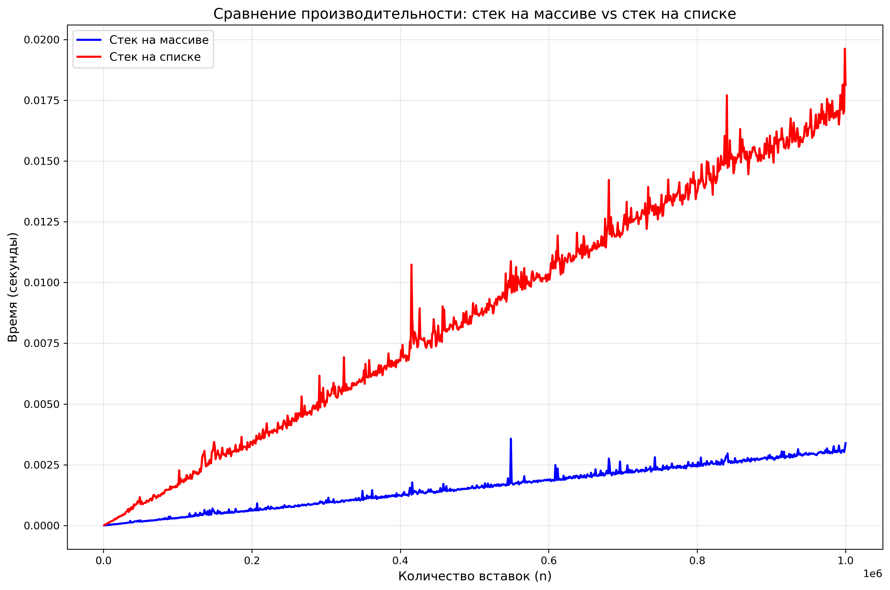

# Лабораторная работа: Сравнение скорости работы динамического массива и односвязного списка

## График сравнения стеков:

## Анализ результатов

### Стек на списке требует больше памяти.

**Стек на массиве:**
- Память выделяется редко
- Всего около 20 операций realloc для 1000000 элементов

**Стек на списке:**
- Память выделяется при каждом push (1000000+ раз)
- Каждый вызов calloc имеет расходы (поиск свободного блока, системные вызовы)

### Хотя асимптотическая сложность одинакова, константы у стека на списке значительно выше.

## Почему стек на динамическом массиве лучше?

1. Намного быстрее в реальных тестах (см. график)
2. Меньше вызовов calloc/realloc => меньше расходов
3. Экономичнее по памяти

## Заключение

Полученные в ходе тестирования результаты подтверждают, что разница в производительности становится особенно заметной при работе с большими объёмами данных, что делает **стек на массиве** предпочтительным выбором.