# Лабораторная работа: Исследование хеш-функций и хеш-таблиц

## Введение

В работе исследованы хеш-функции для целых чисел, чисел с плавающей точкой и строк, а также реализованы и сравнены 5 типов хеш-таблиц.

## 1. Хеш-функции для целых чисел (unsigned int)

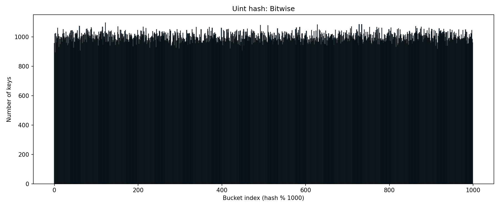

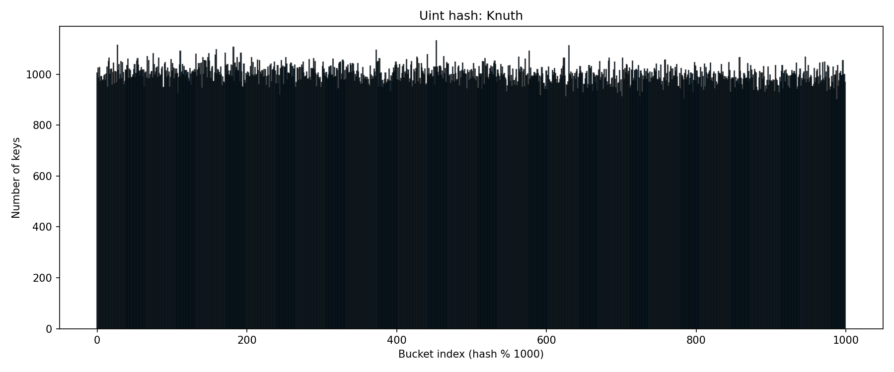

### Выводы:
- Все три функции показывают дисперсию, близкую к идеальной
- **Остаток от деления** - равномерно распределяет случайные ключи, дисперсия 913 (близко к идеалу 1000). Очень быстрая. Для случайных данных младшие биты достаточно равномерны. Но для неслучайных данных будет плохо.
- **Битовое представление** - тоже равномерно, немного медленнее из-за сдвигов. XOR сдвигов перемешивает биты, устраняя закономерности в младших битах.
- **Умножение Кнута** - чуть выше идеала, но всё ещё хорошо. Работает даже для неслучайных данных.

#### Итог: для случайных данных все три хороши. Для реальных данных (с паттернами) лучше использовать Кнута или битовое представление.

## 2. Хеш-функции для чисел с плавающей точкой (float)

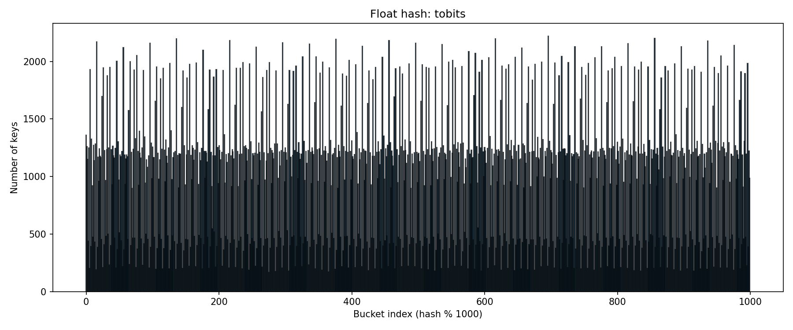

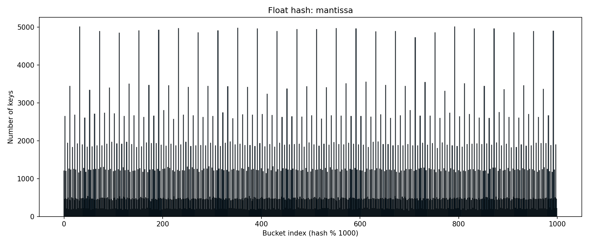

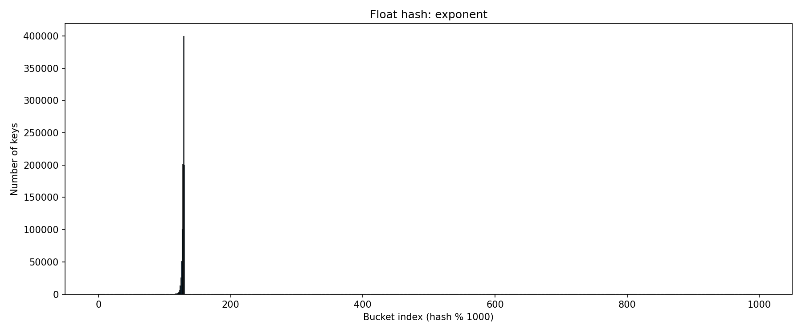

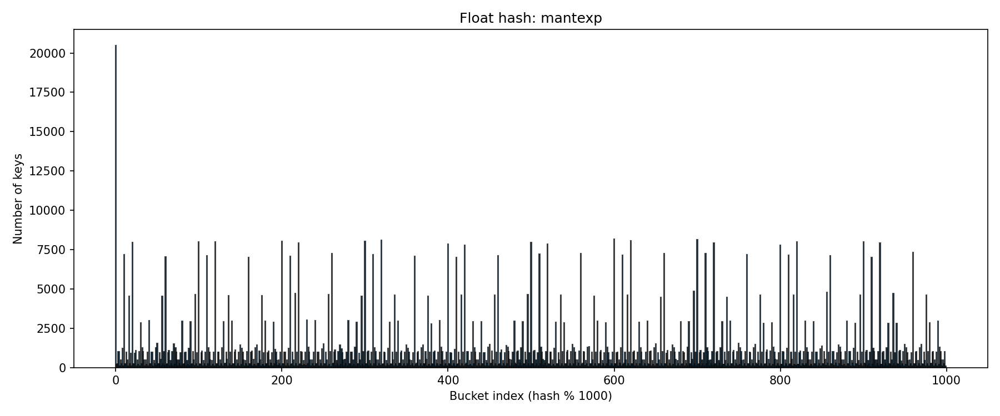

### Выводы:
- Только битовое представление даёт хорошее распределение
- Экспонента даёт ужасную дисперсию
- Мантисса сама по себе тоже так себе
- **Преобразование к int** - прямое преобразование битов в int без перемешивания сохраняет структуру числа. 
- **Битовое представление** - XOR сдвигов устраняет корреляции между соседними битами.
- **Мантисса** - у чисел из [-10, 10] мантиссы распределены неравномерно.
- **Экспонента** - имеет всего 256 возможных значений. При 1 млн ключей коллизии неизбежны.
- **Мантисса × экспонента**	- умножение не решает проблему, всё ещё мало значений.

#### Итог: только битовое представление с перемешиванием даёт хороший результат. Экспонента и мантисса по отдельности непригодны.

Хешировать float имеет смысл, но только через полное битовое представление

## 3. Хеш-функции для строк

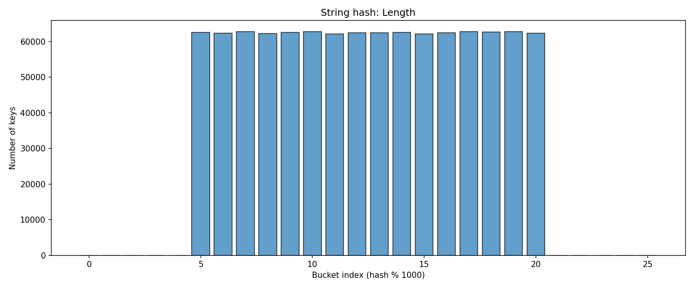

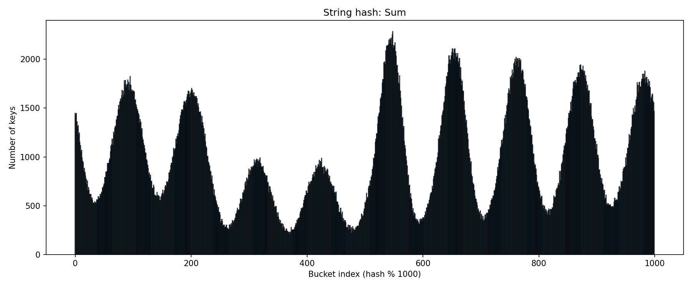

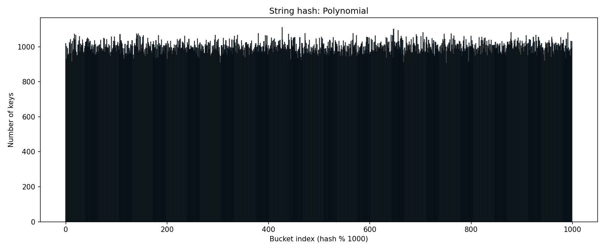

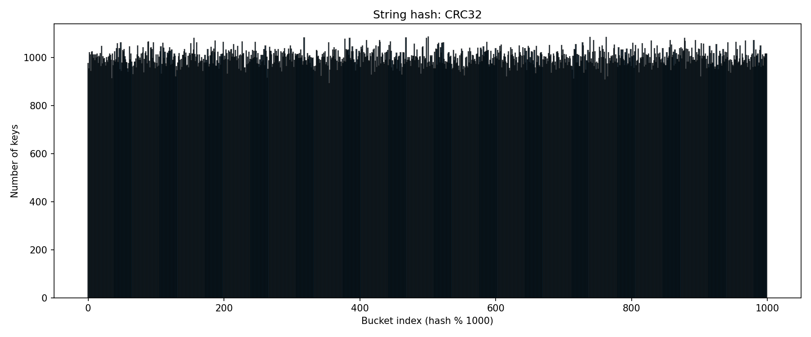

### Выводы:
- Длина строки (5-20) не может равномерно распределиться
- Сумма букв даёт волны на гистограмме - признак коллизий
- Полиномиальный хеш и crc32 показывают отличное распределение
- crc32 в несколько раз медленнее, поэтому полиномиальный хеш - лучший выбор

#### Итог: полиномиальный хеш — лучший выбор для строк. CRC32 избыточен. Длина и сумма букв непригодны.

## 4. Сравнение хеш-таблиц

### 4.1 Зависимость от load factor

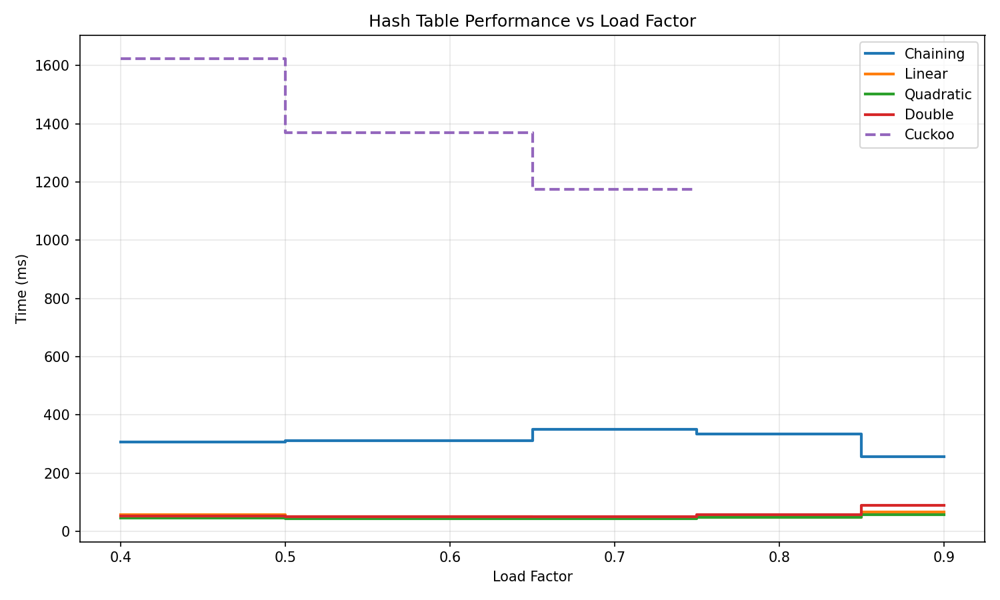

**Выводы:**
- Квадратичное пробирование - стабильно лучшее среди открытых
- Цепочки стабильны, но медленнее из-за работы с указателями
- Кукушка при LF > 0.7 не работает (бесконечные циклы)
- **Оптимальный LF = 0.7** для открытой адресации

### 4.2 Смешанные операции

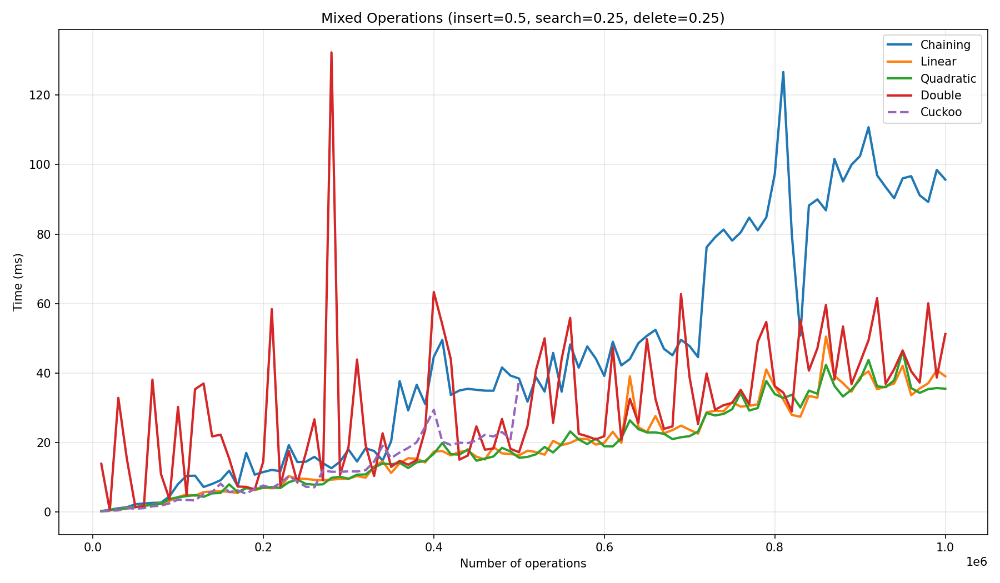

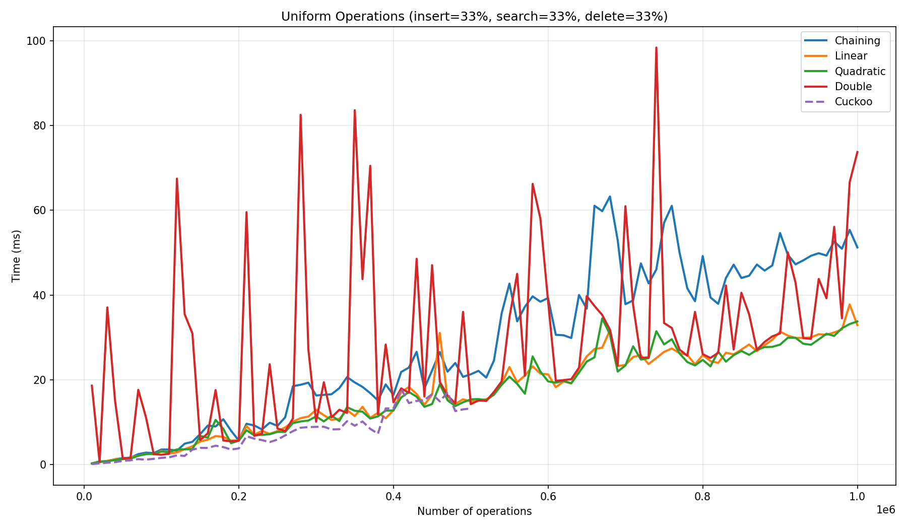

Увеличение доли поиска и удаления (с 25% до 33% каждый)  ухудшает производительность всех таблиц, кроме кукушки (у неё почти без изменений).

- **Линейное пробирование** - стабильно быстрое на всём диапазоне. Время растёт линейно с увеличением числа операций.

- **Квадратичное пробирование** - результаты практически идентичны линейному пробированию. Время также растёт линейно.
- **Двойное хеширование** - ну я хз что за ужас
- **Хеширование цепочками** - заметно медленнее открытой адресации, особенно при большом количестве операций, т.к. каждая операция требует работы с указателями и динамическим выделением памяти под узлы списков, а это создаёт дополнительные расходы.
- **Хеширование кукушки** - до 500 000 операций работает приемлемо

#### Итог: самое хорошее здесь квадратичное, его и берём дальше при исследованиях

## 5. Идеальное хеширование

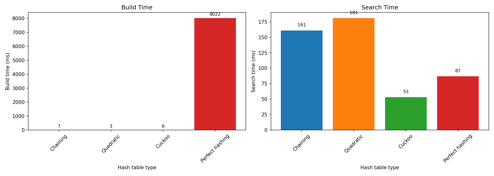

**Выводы:**
- Идеальное хеширование строится значительно дольше
- Поиск у идеального хеша медленнее, чем у кукушки 
- **Нет смысла использовать идеальное хеширование** — кукушка даёт лучший поиск при маленьком времени построения